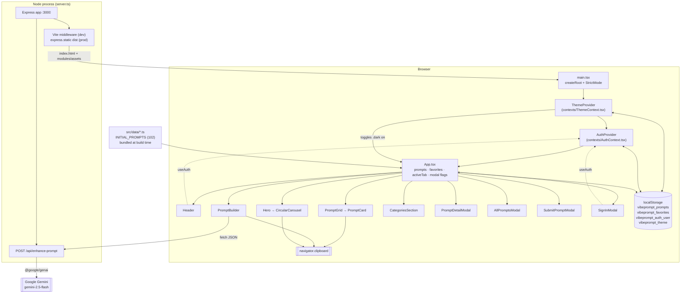

# Single Source of Truth

> Engineering reference for VibePrompt, derived from the code by reading it. Baseline commit `c43745b` (branch `saksham-changes`) plus the uncommitted UI redesign in the working tree — the design-token system (§9.2), the shared primitives (§9.3), theming (§8/§9.2) and the repairs listed in §18.1. Where the code and the README disagree, the code wins and the discrepancy is called out. Unknowable items are labeled **Unknown / Not determinable from the current codebase**.

---

## 1. Project Overview

VibePrompt is a **Vite + React 19 single-page app** served by a **thin Express server** whose only job is (a) hosting the SPA and (b) proxying one Google Gemini call. There is no database, no ORM, no server-side session, and no API surface beyond a single POST route.

All application data is either **compiled into the bundle** (the 102-prompt catalogue in `src/data/`) or kept in the **browser's `localStorage`** (favorites, user-created prompts, the mock signed-in user).

`package.json` still carries the scaffold's name `react-example`; `metadata.json` carries the real product name `VibePrompt`.

---

## 2. Repository Structure

```
.
├── server.ts                     Express app: /api/enhance-prompt + Vite middleware (dev) / static dist (prod)
├── index.html                    Vite entry; loads Google Fonts + pre-paint theme script (no flash)
├── vite.config.ts                React + Tailwind v4 plugins, "@" → ./src alias, DISABLE_HMR handling
├── tsconfig.json                 Non-strict, jsx: react-jsx, noEmit, paths { "@/*": ["./src/*"] }
├── package.json                  Scripts: dev / build / start / preview / clean / lint
├── package-lock.json             npm lockfile  ─┐ two lockfiles are committed
├── bun.lock                      bun lockfile  ─┘
├── metadata.json                 AI Studio applet manifest (name, description, majorCapabilities)
├── .env.example                  Documents GEMINI_API_KEY and APP_URL (APP_URL is unused in code)
├── .gitignore                    node_modules, build, dist, coverage, *.log, .env* (keeps .env.example)
├── .vscode/                      launch.json ("npm install && npm run dev"), settings.json
├── .antigravity/*.pbtxt          33 MB committed agent-session transcript; not application code
├── components/ui/
│   └── circular-carousel.tsx     2-line re-export of src/components/ui/circular-carousel — UNUSED
├── docs/                         This documentation (PRD.md, SSOT.md)
└── src/
    ├── main.tsx                  createRoot → StrictMode → ThemeProvider → AuthProvider → App
    ├── App.tsx                   Root state container: prompts, favorites, activeTab, modals
    ├── index.css                 DESIGN SYSTEM: light/dark tokens, @theme mapping, base layer, utilities
    ├── types.ts                  All shared types: UIPrompt, PromptBuilderConfig, unions
    ├── lib/utils.ts              cn() (clsx + tailwind-merge), formatNumber()
    ├── contexts/
    │   ├── ThemeContext.tsx      Theme provider: light/dark/system, persistence, matchMedia
    │   └── AuthContext.tsx       Mock auth provider + useAuth()
    ├── data/
    │   ├── promptsData.ts        Aggregates the 7 batches into INITIAL_PROMPTS (102 items)
    │   └── promptsBatch1..7.ts   Static UIPrompt[] literals (~184 KB of text total)
    └── components/
        ├── Header.tsx            Sticky bar: wordmark, segmented nav, search, theme toggle, auth menu
        ├── Hero.tsx              Copy block + library figures + CircularCarousel of the first 8 prompts
        ├── PromptGrid.tsx        Library grid: filters, sort, 18/page + infinite scroll
        ├── PromptCard.tsx        Card cell: category, heart, title, description, copy button
        ├── PromptDetailModal.tsx Full-screen detail view (rewritten against the real schema)
        ├── AllPromptsModal.tsx   Full-screen 4-col browser with its own filter/sort/pagination
        ├── PromptBuilder.tsx     Config form + live prompt template + AI refine / copy / save
        ├── SubmitPromptModal.tsx User submission form
        ├── CategoriesSection.tsx 10 hard-coded category cards with live counts
        ├── SignInModal.tsx       Mock GitHub / Google / email sign-in UI (framer-motion)
        ├── Footer.tsx            Static footer
        ├── ThemeToggle.tsx       Light/dark toggle + Light/Dark/System menu
        ├── InteractiveUIPreview.tsx  Mock preview widgets — DEAD CODE, no importers (tokenised only)
        └── ui/
            ├── primitives.tsx    SHARED UI KIT: Button, Input, Select, Textarea, Card, Well, Badge,
            │                     Chip, Kbd, SegmentedControl, EmptyState, ErrorNotice, Skeleton,
            │                     Spinner, Tooltip, SectionHeader, FieldLabel, Label
            └── circular-carousel.tsx  Reusable 5-card circular carousel (framer-motion)
```

---

## 3. Architecture

Two processes at runtime in dev (one Node process hosting Express + Vite middleware; the browser), one in prod (Node serving static files).



**Communication rules that actually hold:**
- The browser talks to the server for exactly one thing: `POST /api/enhance-prompt`. Everything else is bundled or local.
- The Gemini key never leaves the server (`process.env.GEMINI_API_KEY` is read only in `server.ts`).
- Component↔component communication is prop drilling from `App.tsx`. Two contexts exist: `ThemeContext` (outermost) and `AuthContext`.
- No component owns colour. Every surface, border and text colour resolves to a token defined once in `src/index.css`, which is why one class set serves both themes.
- There is no router. "Pages" are `activeTab` values (`'library' | 'builder' | 'categories' | 'favorites'`) plus three boolean/nullable modal states.

---

## 4. Technology Stack

Only what is present in the repository.

| Layer | Technology | Where |
|---|---|---|
| Language | TypeScript ~5.8.2 (non-strict), TSX | `tsconfig.json` |
| UI framework | React 19.0.1 / react-dom 19.0.1 | `package.json`, `src/main.tsx` |
| Build tool | Vite ^6.2.3 (`@vitejs/plugin-react` ^5.0.4) | `vite.config.ts` |
| Styling | Tailwind CSS v4 (`tailwindcss` + `@tailwindcss/vite`) — CSS-first `@import "tailwindcss"`, **no `tailwind.config.js`**; semantic tokens via `@theme inline` | `src/index.css` |
| Theming | Hand-rolled: CSS custom properties + `.dark` class on `<html>`, React context, `matchMedia`, `localStorage` | `src/index.css`, `src/contexts/ThemeContext.tsx` |
| UI kit | Local primitives (no component library) | `src/components/ui/primitives.tsx` |
| Class utilities | `clsx` ^2.1.1 + `tailwind-merge` ^3.6.0 via `cn()` | `src/lib/utils.ts` |
| Icons | `lucide-react` ^0.546.0 — rendered at `currentColor`, so icons theme automatically | all components |
| Animation | `framer-motion` ^12.43.0 (imported). `motion` ^12.23.24 is installed but **never imported** | `SignInModal.tsx`, `ui/circular-carousel.tsx` |
| Server | Express ^4.21.2 + `@types/express` | `server.ts` |
| Env loading | `dotenv` ^17.2.3 (`dotenv.config()`) | `server.ts` |
| AI SDK | `@google/genai` ^2.4.0, model `gemini-2.5-flash` | `server.ts` |
| Dev runner | `tsx` ^4.21.0 (`npm run dev`) | `package.json` |
| Server bundler | `esbuild` ^0.25.0 (CJS bundle for prod server) | `package.json` build script |
| Type check | `tsc --noEmit` as `npm run lint` | `package.json` |
| Node types | `@types/node` ^22.14.0 | — |
| Database / ORM | **None** | — |
| Authentication library | **None** (hand-rolled mock) | `src/contexts/AuthContext.tsx` |
| Component library (Radix/shadcn) | **None** — `Radix UI`/`Shadcn UI` appear only as prompt *content*, never as dependencies | — |
| Testing | **None** — no framework, no test files, no `coverage` output despite `.gitignore` listing it | — |
| Linting (ESLint/Prettier) | **None** — `lint` is only `tsc` | — |
| CI / IaC / containers | **None** | — |
| Missing but expected | `@types/react`, `@types/react-dom` are **not installed** — see §18 | `node_modules/@types/` |
| `autoprefixer` ^10.4.21 | devDependency, but no PostCSS config exists (Tailwind v4 handles prefixing) | — |

---

## 5. Application Flow

### 5.1 Cold start (dev)
1. `npm run dev` → `tsx server.ts`.
2. `dotenv.config()` loads `.env` if present.
3. `express.json()` mounted. `POST /api/enhance-prompt` registered.
4. `NODE_ENV !== 'production'` → `createViteServer({ server: { middlewareMode: true }, appType: 'spa' })`, `app.use(vite.middlewares)`.
5. `app.listen(3000, '0.0.0.0')`.
6. Browser GET `/` → Vite serves `index.html` → `/src/main.tsx` → `createRoot(...).render(<StrictMode><AuthProvider><App/></AuthProvider></StrictMode>)`.

### 5.2 App state hydration (`src/App.tsx`)
- `prompts` lazy initializer: read `localStorage['vibeprompt_prompts']` → `JSON.parse` → keep only entries whose `id` is **not** in `INITIAL_PROMPTS` → return `[...INITIAL_PROMPTS, ...customOnly]`. Any throw → fall back to `INITIAL_PROMPTS`.
- `favorites` lazy initializer: parse `localStorage['vibeprompt_favorites']` or `[]`.
- Two `useEffect`s mirror `favorites` and `prompts` back to `localStorage` on every change.
- `AuthProvider` separately restores `localStorage['vibeprompt_auth_user']` on mount and flips `isLoading` false.
- `ThemeProvider` initialises from `localStorage['vibeprompt_theme']` (default `system`), resolves it against `prefers-color-scheme`, and writes the `dark` class + `color-scheme` onto `<html>`. The inline script in `index.html` has already done this before React mounts, so the provider only keeps it in sync.

### 5.3 Browse → filter → render (`PromptGrid.tsx`)
`prompts` → `filter` (category → tool → search) → `sort` (likes | copies | createdAt) → `slice(0, visibleCount)` → map to `PromptCard`. `visibleCount` starts at 18 and resets whenever `selectedCategory`, `selectedTool`, `sortBy`, or `searchQuery` changes. An `IntersectionObserver` on a sentinel div (threshold 0.1, rootMargin 100px) calls `handleLoadMore`, which bumps `visibleCount` by 18 after a 200 ms `setTimeout`. `AllPromptsModal` repeats this pattern with `useMemo` and a page size of 20.

### 5.4 Copy flow
`PromptCard.handleCopy` → `e.stopPropagation()` (so the card's own click doesn't open the detail view) → `navigator.clipboard.writeText(prompt.fullPrompt)` → `onCopyPrompt(prompt)` → `App.handleCopyPrompt` maps the prompt array incrementing `copies` → local state change → `useEffect` rewrites the whole array to `localStorage`. The clipboard promise is not awaited and rejections are unhandled.

### 5.5 AI refinement round trip
```
PromptBuilder.handleEnhanceWithAI()
  → fetch('/api/enhance-prompt', POST, JSON.stringify(config))   // config = full PromptBuilderConfig
  → server: read GEMINI_API_KEY
      ├─ missing → 400 { error }                     → client sets a hard-coded fallback template
      └─ present → build meta-prompt string
                 → new GoogleGenAI({apiKey}).models.generateContent({ model:'gemini-2.5-flash', contents })
                 → 200 { enhancedPrompt: response.text ?? '' }   → client setEnhancedTextOverride(...)
      └─ throw   → 500 { error: message }             → client sets the same fallback template
  (fetch itself rejects → console.error, no UI change)
finally → setIsEnhancing(false)
```
Any subsequent config edit calls `setEnhancedTextOverride(null)`, reverting the pane to the locally templated text.

### 5.6 Production request flow
`npm run build` → `vite build` (→ `dist/index.html` + `dist/assets/*`) and `esbuild server.ts --bundle --platform=node --format=cjs --packages=external → dist/server.cjs`. `npm start` → `node dist/server.cjs` with `NODE_ENV=production` expected → `express.static(cwd/dist)` then `app.get('*')` → `dist/index.html`. **Note:** the `start` script does not set `NODE_ENV`; if it is unset, the production bundle will try to boot Vite in middleware mode instead of serving `dist/`.

---

## 6. Data Model

There is **no database**. The "data model" is the TypeScript types in `src/types.ts` plus three `localStorage` keys.

### 6.1 `UIPrompt` (`src/types.ts:48-65`) — the central entity

| Field | Type | Notes / who reads it |
|---|---|---|
| `id` | `string` | Unique. Bundled prompts use slugs (`glassmorphism-crypto-analytics`); builder → `custom-builder-<Date.now()>`; submissions → `user-submitted-<Date.now()>`. Verified: no duplicates among the 102 bundled prompts |
| `title` | `string` | Rendered everywhere; searched |
| `description` | `string` | Card/carousel copy; searched |
| `fullPrompt` | `string` | **The product payload** — what gets copied. Searched |
| `category` | `PromptCategory` | Filter key + card badge |
| `style` | `DesignStyle` | Searched in `AllPromptsModal` only |
| `techStack` | `TechStackItem[]` | Searched |
| `targetTools` | `TargetTool[]` | Tool filter |
| `author` | `{ name; handle; avatar }` | **Only `handle` is rendered**; `name` and `avatar` are never displayed |
| `likes` | `number` | Sort key "Popular"; static — no code ever increments it |
| `copies` | `number` | Sort key "Copied"; incremented client-side on copy |
| `isFeatured?` | `boolean` | Set on 20 prompts; **read nowhere** |
| `createdAt` | `string` (`YYYY-MM-DD`) | Sort key "Newest"; parsed with `new Date()` |
| `componentsIncluded` | `string[]` | Written by builder/submit; read only by the dead `InteractiveUIPreview` |
| `colorTheme` | `string` | Same — written, never read at runtime |
| `previewLayout` | union of 10 literals | Same — only the dead preview component branches on it |

### 6.2 Supporting types
- `PromptCategory` — 12 literals: `Dashboard`, `Landing Page`, `SaaS`, `Dark Mode`, `Minimalist`, `E-commerce`, `Mobile App`, `Portfolio`, `AI Agent UI`, `Analytics`, `Bento Grid`, `FinTech`.
- `DesignStyle` — 13 literals, with near-duplicates that indicate accretion over time: `Bento Grid` vs `Bento`, `Cyberpunk Neon` vs `Cyberpunk`, plus `Dark Mode`/`SaaS Modern` which are also category-ish values.
- `TechStackItem` — 8 literals (`Tailwind CSS`, `Shadcn UI`, `Framer Motion`, `Lucide Icons`, `Recharts`, `Radix UI`, `TypeScript`, `Next.js`).
- `TargetTool` — `v0 | Cursor | Bolt.new | Claude | Windsurf`.
- `Author` — `{ name; avatar; handle }`.
- `PromptBuilderConfig` — `{ interfaceType: string; designStyle; techStack[]; components: string[]; colorTheme: string; targetTool; customInstructions: string }`. This is the exact JSON body of `POST /api/enhance-prompt`.
- `User` (in `src/contexts/AuthContext.tsx`, not `types.ts`) — `{ id; name; email; avatar; provider: 'github'|'google'|'email' }`.

### 6.3 Actual data distribution (measured over `INITIAL_PROMPTS`, 102 items)

- **Categories:** AI Agent UI 26, Dashboard 20, FinTech 16, E-commerce 10, Mobile App 8, Portfolio 7, Bento Grid 7, Analytics 3, SaaS 3, Landing Page 2. `Dark Mode` and `Minimalist` are declared in the type but used by **no** prompt as a category.
- **Styles used:** SaaS Modern 40, Dark Mode 29, Minimalist 19, Bento 10, Cyberpunk 2, Glassmorphism 1, Neubrutalism 1. `Glassmorphism`, `Obsidian Dark`, `Neumorphic`, `Gradient Accent`, `Retrowave Tech`, `Bento Grid`, `Cyberpunk Neon` are largely or entirely unused despite being the builder's options.
- **Target tools:** every prompt lists `v0` and `Cursor`; `Bolt.new` 74, `Claude` 28, `Windsurf` 28.
- **Tech stack values in use:** Tailwind CSS, Shadcn UI, Framer Motion, Recharts, Lucide Icons, TypeScript (`Radix UI` and `Next.js` are declared but unused in data).
- **`isFeatured`:** 20 prompts. **`createdAt` range:** 2025-10-15 → 2026-08-01.
- Serialized size of the corpus: ~184 KB.

### 6.4 Relationships & constraints
- No foreign keys or joins. Category/style/tool "relationships" are string equality against literal unions.
- Uniqueness of `id` is assumed, not enforced. The only dedup logic is the load-time filter in `App.tsx:24`, which drops stored prompts whose id collides with a bundled prompt. Two submissions inside the same millisecond would collide (`Date.now()`), which React would surface as a duplicate `key`.
- Type unions are not validated at runtime. `SubmitPromptModal` casts free-text tech-stack input with `as TechStackItem`, so arbitrary strings enter typed fields; `PromptBuilder` casts a derived category with `as any` (`PromptBuilder.tsx:150`).

### 6.5 `localStorage` schema (the real persistence layer)

| Key | Written by | Shape | Notes |
|---|---|---|---|
| `vibeprompt_prompts` | `App.tsx` effect on every `prompts` change | `UIPrompt[]` (the *entire* array, bundled + custom) | ~184 KB+ per write. On read, bundled ids are discarded in favor of the compiled data, so `copies` increments on bundled prompts do not survive a reload |
| `vibeprompt_favorites` | `App.tsx` effect | `string[]` of prompt ids | Survives reloads; no auth needed |
| `vibeprompt_auth_user` | `AuthContext.signIn` / cleared by `signOut` | `User` | Trusted blindly on load; forgeable, but protects nothing |
| `vibeprompt_theme` | `ThemeContext` effect | `'light' \| 'dark' \| 'system'` | Also read by the pre-paint script in `index.html`; the two must stay in sync |

All access is wrapped in `try/catch` with `console.error` (except `AuthContext.signIn`'s write and `signOut`'s remove, which are unguarded).

---

## 7. API Reference

The server exposes exactly one API route. Everything else is static/SPA serving.

### `POST /api/enhance-prompt`

- **Purpose:** Ask Gemini to expand a builder configuration into a full "vibe coding" prompt.
- **Implementation:** `server.ts:14-58`.
- **Authentication:** **None.** No key, token, session, origin check, or rate limit.
- **Request:** `Content-Type: application/json`; body is a `PromptBuilderConfig` (client always sends the whole object). All fields are optional server-side; the server substitutes defaults:

| Field | Type | Server default when falsy |
|---|---|---|
| `interfaceType` | string | `"Dashboard"` |
| `designStyle` | string | `"Minimalist"` |
| `targetTool` | string | `"v0 / Cursor"` (and `"v0 / Cursor / Bolt"` in the opening sentence) |
| `techStack` | string[] | `"Tailwind CSS, Shadcn UI, Framer Motion"` |
| `components` | string[] | `"Header, Cards, Data Table"` |
| `colorTheme` | string | `"Indigo / Dark Slate"` |
| `customInstructions` | string | `"High contrast dark mode, fluid responsiveness, smooth animations"` |

  `techStack` and `components` are `.join(", ")`ed, so any non-array truthy value would throw → 500.

- **Responses:**
  | Status | Body | Condition |
  |---|---|---|
  | 200 | `{ "enhancedPrompt": string }` | Success. `response.text \|\| ""` — an empty string is a valid 200 |
  | 400 | `{ "error": "GEMINI_API_KEY is not configured." }` | Env var missing/empty (verified by request) |
  | 500 | `{ "error": <error.message \| "Failed to generate AI prompt"> }` | SDK/network/other throw; message is echoed to the client and logged server-side |

- **Important behavior:** the model is hard-coded to `gemini-2.5-flash`; the meta-prompt instructs the model to return raw text with no markdown fences; the response is not validated, sanitized, or length-capped; the client renders it inside a `<pre>` (text only, so no HTML injection risk).
- **Consumer:** `PromptBuilder.handleEnhanceWithAI` (`src/components/PromptBuilder.tsx:113-143`). Non-2xx responses are treated as "use the local fallback", so the user cannot distinguish "no API key" from "quota exceeded".

### Non-API routes

| Method | Route | Behavior | Location |
|---|---|---|---|
| GET | `/*` (dev) | Vite middleware serves `index.html`, TS/TSX modules, HMR | `server.ts:62-68` |
| GET | `/*` (prod) | `express.static('<cwd>/dist')`, then SPA fallback to `dist/index.html` | `server.ts:69-74` |

---

## 8. Authentication & Authorization

**There is no real authentication.** `src/contexts/AuthContext.tsx` is a client-only simulation.

```mermaid
sequenceDiagram
    participant U as User
    participant M as SignInModal
    participant C as AuthContext
    participant L as localStorage
    U->>M: click GitHub / Google / submit email+password
    M->>C: signIn(provider, email?, password?)
    C->>C: setIsLoading(true); await sleep(1200ms)
    C->>C: fabricate User (hard-coded for github/google; email local-part otherwise)
    Note over C: password is never checked or transmitted
    C->>L: setItem('vibeprompt_auth_user', JSON.stringify(user))
    C->>C: setUser(user); setIsAuthModalOpen(false); setIsLoading(false)
    M->>M: success overlay 1500ms → onClose()
```

Implementation facts developers must know:
- `AuthContextType` = `{ user, isAuthenticated: !!user, isLoading, isAuthModalOpen, signIn, signOut, openAuthModal, closeAuthModal }`.
- `isLoading` is `true` until the mount effect finishes, and is also reused as the sign-in spinner flag — but no component consumes `isLoading`; `SignInModal` tracks its own `activeProvider`/`isSuccess`.
- `generateAvatarUrl(name)` builds an inline SVG data URI (indigo→cyan gradient + up to 2 initials). No remote avatar fetch.
- `signOut()` clears state and the storage key; nothing else is invalidated because nothing else depends on identity.
- `useAuth()` throws `"useAuth must be used within an AuthProvider"` outside the provider. `AuthProvider` wraps `<App/>` in `src/main.tsx`, so all components are covered.
- **Authorization: none.** No guards, no roles, no protected routes, no server-side checks. Favorites, submissions, the builder, and the Gemini endpoint all work while signed out.

Consumers: `Header.tsx` (`user`, `isAuthenticated`, `signOut`, `openAuthModal`), `SignInModal.tsx` (`signIn`), `App.tsx` (`isAuthModalOpen`, `closeAuthModal`).

---

## 9. Frontend Architecture

### 9.1 "Routing" (there is none)
`App.tsx` holds `activeTab: 'library' | 'builder' | 'categories' | 'favorites'` plus overlay state:

| State | Type | Overlay |
|---|---|---|
| `selectedPromptModal` | `UIPrompt \| null` | `PromptDetailModal` (full-screen) |
| `isSubmitModalOpen` | `boolean` | `SubmitPromptModal` |
| `isAllPromptsModalOpen` | `boolean` | `AllPromptsModal` (full-screen) |
| `isAuthModalOpen` | from `AuthContext` | `SignInModal` |

`Hero` renders only on the `library` and `favorites` tabs. `main` renders `PromptBuilder`, `CategoriesSection`, or `PromptGrid` (the default, also used for `favorites`). Tab side effects live in the `setActiveTab` wrapper passed to `Header` (`favorites` → `selectedCategory = 'Favorites'`; `library` → `'All'`). No URL changes, no history entries, no deep links.

### 9.2 Design system

Defined once in `src/index.css`; **no component may hardcode a palette colour**.

- **Structure:** raw values live on `:root` (light) and `.dark` (dark) as custom properties; `@theme inline` maps them to Tailwind utilities (`--background` → `bg-background`, `--muted-foreground` → `text-muted-foreground`, …). `@custom-variant dark (&:where(.dark, .dark *))` provides the `dark:` variant for the rare case a component needs it.
- **Semantic colour tokens:** `background`, `surface`, `surface-secondary`, `surface-tertiary`, `hover`, `active`, `overlay`, `foreground`, `muted-foreground`, `subtle-foreground`, `border`, `border-strong`, `input`, `ring`, `primary` / `primary-foreground` / `primary-hover`, `accent` / `accent-foreground` / `accent-muted` / `accent-border`, `success` / `success-muted`, `destructive` / `destructive-muted`.
- **Colour strategy:** the interface is neutral. `primary` is near-black in light and near-white in dark — the only high-contrast fill. A single blue `accent` is reserved for focus rings, links, the active menu check and selected-state hints. `success` / `destructive` appear only as status feedback (copy confirmation, sign-out, error notices). Nothing is coloured decoratively.
- **Elevation:** `--elevation-popover` / `--elevation-modal` mapped to `shadow-popover` / `shadow-modal`. Only menus and modals lift; cards use borders and surface steps for hierarchy. Note the raw variables are deliberately named `--elevation-*` because `@theme inline` would otherwise self-reference `--shadow-*`.
- **Radius:** `rounded-md` (6 px) for controls, `rounded-lg` (8 px) for cards and panels, `rounded-xl` (12 px) for modals. Pills are used only for status dots and progress tracks.
- **Type:** `--font-sans` Plus Jakarta Sans, `--font-mono` JetBrains Mono (metadata, counts, code, labels). Scale in use: page title `text-2xl`–`text-4xl` semibold, section heading `text-lg`/`text-xl` semibold, card title `text-[13px]` semibold, body `text-sm`, metadata `text-xs`/`text-[11px]`, uppercase field labels `text-[11px]` tracked. Nothing is heavier than `font-semibold`.
- **Layout:** `.container-page` (max 1280 px) and `.container-prose` (max 960 px) own the page gutters, so every section aligns. Vertical rhythm is `py-10`/`py-12` per section with `gap-3`/`gap-5` inside.
- **Motion:** `animate-fade-in` (140 ms), `animate-fade-in-up` (160 ms, menus), `animate-scale-in` (180 ms, modals), plus a 140 ms colour transition on theme change. All of it is disabled under `prefers-reduced-motion`.

### 9.3 Primitives

`src/components/ui/primitives.tsx` is the single source for interactive styling — hover, focus, disabled and selected states are defined once here rather than per component.

| Primitive | Notes |
|---|---|
| `Button` | variants `primary \| secondary \| ghost \| accent \| destructive`; sizes `sm \| md \| lg \| icon \| icon-sm`; `loading` shows a spinner and disables |
| `Input` / `Textarea` / `Select` | shared field styling; `Select` keeps the native caret so it follows `color-scheme` in both themes |
| `Label` / `FieldLabel` | sentence-case field label / uppercase group label |
| `Card` (`interactive`) / `Well` | raised surface / recessed surface |
| `Badge` | `neutral \| outline \| accent \| success \| destructive` |
| `Chip` | toggle; `tone="solid"` for single-select filters, `tone="soft"` for multi-select groups |
| `SegmentedControl` | primary nav and in-view tabs; `role="tablist"` |
| `EmptyState` / `ErrorNotice` / `Skeleton` / `Spinner` | the standard feedback states |
| `Tooltip` | CSS-only, hover-only (focus would strand it open after a modal opens) |
| `SectionHeader` | title + description + actions; one hierarchy for every view header |
| `Kbd` | keycap styling |

### 9.4 State management
- **Local `useState` only.** No Redux/Zustand/React Query. The single context is `AuthContext`.
- **Owned by `App.tsx`:** `prompts`, `favorites`, `activeTab`, `selectedCategory`, `searchQuery`, and the modal flags. Handlers: `handleToggleFavorite`, `handleSavePrompt` (prepend), `handleCopyPrompt` (increment `copies`), `handleOpenBuilderWithPrompt`.
- **Duplicated local state:** `AllPromptsModal` maintains its **own** `searchQuery`/`selectedCategory`/`selectedTool`/`sortBy`, so filters do not carry over between the grid and the modal. `PromptGrid` owns `selectedTool` and `sortBy` locally while `selectedCategory`/`searchQuery` come from `App`.
- **Derived state** is recomputed inline every render in `PromptGrid` and memoized with `useMemo` in `AllPromptsModal` — same logic, two implementations.

### 9.5 Data fetching
One `fetch` in the entire client (`PromptBuilder`). No SWR/React Query, no loading skeletons beyond local booleans (`isEnhancing`, `isLoadingMore`), no retry, no abort.

### 9.6 Forms
Uncontrolled-by-nothing: all inputs are controlled `useState` fields.
- `SubmitPromptModal` — native `<form onSubmit>`, `required` on title and full prompt plus a manual `if (!title || !fullPrompt) return;`. Comma-split parsing for tech stack. No length limits, no sanitization.
- `SignInModal` — `<form onSubmit>` with `required` email/password; password unused downstream.
- `PromptBuilder` — no `<form>`; selects and chip buttons mutate `config` directly.

### 9.7 Client/server boundary
- Server-only: `GEMINI_API_KEY`, `@google/genai`, the meta-prompt template.
- Client-only: the whole prompt catalogue (bundled), all persistence, all "auth".
- Nothing is server-rendered. `"use client"` at the top of `ui/circular-carousel.tsx` is a leftover from a Next.js-oriented source and is a no-op here.

### 9.8 Component notes worth knowing before editing
- `Hero` still accepts `searchQuery`, `setSearchQuery`, `selectedCategory`, `setSelectedCategory` and uses none of them (search lives in the header and the grid). `onOpenBuilder` **is** now wired, to the hero's "Open builder" CTA.
- **Breakpoint contract:** primary nav is inline from `lg` up and moves to a second header row below `lg`; the header search input appears from `lg` (narrow) and widens at `xl`; the "View all" label appears at `xl`. These were tuned against measured overflow — the inline nav does not fit beside the actions at `md`/`834 px`, so do not lower that crossover without re-measuring.
- `Select` intentionally keeps its native caret. Adding `appearance-none` removes it and the control becomes indistinguishable from a text input.
- `App` passes `onOpenBuilderWithPrompt` to `PromptDetailModal`, which does not declare that prop; `handleOpenBuilderWithPrompt` is therefore dead (it also ignores its `prompt` argument).
- `components/ui/circular-carousel.tsx` (repo root) re-exports the real component; nothing imports it. The real path is `src/components/ui/circular-carousel.tsx`, imported by `Hero` as `./ui/circular-carousel`.
- `CircularCarousel` is controllable (`activeIndex` + `onActiveChange`) or self-managing; `Hero` uses it controlled. `getItemPosition` shows at most 5 cards (offsets −2…+2) on an elliptical path (`RADIUS_X` 230, `RADIUS_Y` 85) with distance-based scale/opacity/z-index. Autoplay pauses on hover/focus. Arrow keys are bound to the container element, so it must be focused.
- Modals lock `document.body.style.overflow` while open and restore it on close/unmount. There is no focus trap and no `aria-modal`.
- Tailwind classes such as `line-clamp-*`, `scrollbar-none`, and `animate-in fade-in slide-in-from-top-2` are used; `animate-in` and the two keyframes are hand-defined in `src/index.css`, but `fade-in` / `slide-in-from-top-2` / `scrollbar-none` as standalone utilities are **not** defined anywhere and have no effect.

---

## 10. Backend Architecture

`server.ts` is 80 lines and has no layering — no controllers, services, repositories, middleware (beyond `express.json()`), background jobs, queues, or scheduled work.

```
dotenv.config()
express()
  └─ express.json()                       // 100 KB default body limit
  └─ POST /api/enhance-prompt             // inline handler: env check → build meta-prompt → Gemini → JSON
startServer()
  ├─ dev  : createViteServer({ middlewareMode: true, appType: 'spa' }) → app.use(vite.middlewares)
  └─ prod : express.static(process.cwd() + '/dist') → app.get('*') → sendFile(dist/index.html)
  └─ app.listen(3000, '0.0.0.0')
```

Business logic on the server is limited to the meta-prompt template (`server.ts:24-46`), which asks for five fixed sections: design objective, component architecture, palette/typography, interactive states/micro-animations, technical requirements.

Notable properties: no graceful shutdown, no health endpoint, no request logging, no CORS setup (same-origin by construction), no error-handling middleware (the single handler try/catches itself), `PORT` hard-coded to `3000`, and `startServer()` is called without a `.catch()` so a Vite bootstrap failure becomes an unhandled rejection.

---

## 11. Configuration & Environment Variables

| Variable | Read at | Required? | Purpose |
|---|---|---|---|
| `GEMINI_API_KEY` | `server.ts:17` (`process.env`) | Required for AI Refine; the app otherwise runs fine | Google Gemini API credential. Never exposed to the client. Missing → HTTP 400 from `/api/enhance-prompt` |
| `NODE_ENV` | `server.ts:61` | Effectively required in production | `!== 'production'` selects Vite middleware mode; `=== 'production'` serves `dist/`. **`npm start` does not set it** |
| `DISABLE_HMR` | `vite.config.ts:12,15` | Optional | `'true'` disables HMR and file watching (documented as an AI Studio agent-editing accommodation) |
| `APP_URL` | documented in `.env.example` | Not used | Declared for the AI Studio platform; **no code reads it** |

`.env` is loaded by `dotenv` and is git-ignored (`.gitignore` ignores `.env*` but un-ignores `.env.example`). A local `.env` exists in this working copy; its contents are not reproduced here. Never commit real keys. Note also that `.env` is only read by the Node process — Vite's `import.meta.env` is not used anywhere, and no variable is exposed to the browser.

---

## 12. External Integrations

1. **Google Gemini** — `@google/genai`, server-side, single call site:
   ```ts
   const ai = new GoogleGenAI({ apiKey });
   const response = await ai.models.generateContent({ model: "gemini-2.5-flash", contents: promptText });
   const enhancedPrompt = response.text || "";
   ```
   No streaming, no tools/function calling, no system-instruction field (the role framing is inline in `contents`), no `generationConfig`, no safety-setting overrides, no retries, no timeout, no token accounting.
2. **Google Fonts** — `<link>` tags in `index.html` for Plus Jakarta Sans and JetBrains Mono. (Instrument Serif was dropped: the only utility using it was never applied.) Offline or blocked environments fall back to the system and `monospace` stacks declared on `--font-sans` / `--font-mono`.
3. **Unsplash images** — hard-coded `author.avatar` URLs in prompt data and in `PromptBuilder`/`SubmitPromptModal`. No component renders `author.avatar`, so no request is actually made.
4. **Browser Clipboard API** — `navigator.clipboard.writeText` in `PromptCard`, `PromptBuilder`, `Hero`. Requires a secure context (HTTPS or localhost); rejections are unhandled, so a denied clipboard silently still shows "Copied".
5. **Google AI Studio (origin platform)** — `metadata.json` declares `MAJOR_CAPABILITY_SERVER_SIDE_GEMINI_API`; `.env.example` documents that the platform injects `GEMINI_API_KEY` and `APP_URL`; the README links to `ai.studio/apps/c7b139fb-…`, matching the `.antigravity` session filename. Whether the app is actually deployed there is **Unknown / Not determinable from the current codebase**.

---

## 13. Error Handling

| Site | Behavior |
|---|---|
| `POST /api/enhance-prompt` | `try/catch` → `console.error("Error enhancing prompt:", error)` → 500 with `error.message` echoed to the client (internal message leakage, low value here) |
| Missing API key | Explicit 400 with a specific message — the one well-signposted failure, and the client hides it |
| `PromptBuilder.handleEnhanceWithAI` | Non-`ok` response → substitute a hard-coded fallback prompt (**no user-visible error**). Thrown fetch → `console.error` only. `finally` always clears the spinner |
| `App` localStorage read/write | `try/catch` + `console.error`; read failures fall back to `INITIAL_PROMPTS` / `[]` |
| `AuthContext` restore | `try/catch` + `console.error`; a corrupt entry leaves the user signed out. The write path is unguarded (quota errors would throw inside `signIn`) |
| `SignInModal.handleSignIn` | `try/catch` → `console.error` + reset `activeProvider`. Unreachable in practice: `signIn` never rejects |
| Clipboard | No `.then`/`.catch` anywhere; UI reports success unconditionally |
| React render errors | **No error boundary.** The `PromptDetailModal` defect (§18) therefore unmounts the whole tree rather than degrading |
| `startServer()` | No `.catch()` → unhandled promise rejection on startup failure |

There is no user-facing error component, toast, or banner in the entire codebase.

---

## 14. Testing

- **No tests exist.** No test runner (no Vitest/Jest/Playwright/Testing Library in `package.json`), no `*.test.*` / `*.spec.*` files, no `__tests__`, no CI workflow. `.gitignore` lists `coverage/` but nothing produces it.
- The only automated check is `npm run lint` → `tsc --noEmit`, and **it is much weaker than it appears**:
  - `tsconfig.json` sets no `strict`, `strictNullChecks`, `noUnusedLocals`, or `noUnusedParameters`.
  - `@types/react` and `@types/react-dom` are **not installed** (verified: `node_modules/@types/` contains only babel/express/node/etc.). With `allowJs` + `skipLibCheck`, `React.FC<Props>` degrades to `any`, so **component props are unchecked**.
  - Verified experimentally: accessing `prompt.promptText` on a `UIPrompt` errors in a `.ts` file (`TS2339`) but produces **no error** inside a `.tsx` component whose props come through `React.FC`. This is exactly why the `PromptDetailModal` schema mismatch passes `npm run lint`.
- **Highest-value gaps** if testing is introduced: prompt filter/sort/search purity, `localStorage` hydration/merge logic in `App.tsx`, the `/api/enhance-prompt` handler (both error paths), and a smoke render of every component with a real `UIPrompt` (which would have caught the schema mismatch in §18.1 immediately).

---

## 15. Build & Development

```bash
npm install          # (bun.lock is also committed; pick one package manager)
npm run dev          # tsx server.ts → Express + Vite middleware on http://0.0.0.0:3000
npm run lint         # tsc --noEmit  (weak — see §14)
npm run build        # vite build → dist/  AND  esbuild server.ts → dist/server.cjs
npm start            # node dist/server.cjs   (set NODE_ENV=production yourself)
npm run preview      # vite preview (static dist only; /api/* will 404)
npm run clean        # rm -rf dist server.js
```

Verified in this environment: `npm run dev` boots and serves `/` (200); `POST /api/enhance-prompt` with no key returns 400 with the documented body; `npm run build` succeeds, emitting `dist/index.html` (1.61 KB — it now carries the pre-paint theme script), `dist/assets/index-*.css` (~125 KB), `dist/assets/index-*.js` (~634 KB, gzip ~193 KB) plus a Vite >500 KB chunk warning, and `dist/server.cjs` (4.1 KB).

Conventions and gotchas:
- Import alias `@/*` → `./src/*` in **both** `tsconfig.json` and `vite.config.ts`. Keep them in sync. Only `ui/circular-carousel.tsx` currently uses it (`@/lib/utils`, `@/types`); everything else uses relative paths.
- `allowImportingTsExtensions` is on, and `src/main.tsx` imports `./App.tsx` with the extension. Mixed style across the repo.
- Prompt data lives in seven sibling files purely for file-size manageability; add new prompts to a batch (or a new batch registered in `promptsData.ts`).
- The dev server and API share port 3000, so the client can use the relative path `/api/enhance-prompt` with no proxy config.
- `npm run clean` references `server.js`, which the build never produces (it emits `dist/server.cjs`) — harmless leftover.

---

## 16. Deployment

**No deployment configuration exists in the repository** — no Dockerfile, no `Procfile`, no `app.yaml`/`cloudbuild.yaml`, no CI workflow, no Terraform, no platform config files.

What the repo does imply:
- The build produces a self-contained `dist/` (static SPA + `server.cjs`), runnable as `NODE_ENV=production node dist/server.cjs` on a host that provides `GEMINI_API_KEY`.
- `--packages=external` means `node_modules` must be installed on the target (production deps only is sufficient).
- Port 3000 is hard-coded and bound to `0.0.0.0` — container-friendly, but incompatible with platforms that inject a `$PORT` (including Cloud Run's default 8080) without a code change.
- `.env.example` and `metadata.json` indicate the intended host was **Google AI Studio / Cloud Run**, with the platform injecting `GEMINI_API_KEY` and `APP_URL`. The actual deployment target, domain, and pipeline are **Unknown / Not determinable from the current codebase**.

---

## 17. Important Invariants / Business Rules

1. **`GEMINI_API_KEY` must never reach the client.** Keep all `@google/genai` usage in `server.ts`; never expose it via `import.meta.env` or a `VITE_`-prefixed variable.
2. **`fullPrompt` is the product.** It is what users copy. Do not truncate, transform, or lossily re-serialize it. Any new prompt-rendering surface must read `fullPrompt`; `promptText`, `tags`, `targetTool` and `complexity` do not exist on `UIPrompt` (the detail view used to reference them and crashed).
3. **`UIPrompt.id` must be unique and stable.** `App.tsx` merges storage with bundled data by id; changing a bundled prompt's id orphans users' favorites (favorites store ids, with no cleanup for missing prompts).
4. **Anything written into `prompts` gets serialized to `localStorage` in full.** Do not add non-serializable values (functions, `Date`, DOM nodes, React elements) to `UIPrompt`, and be mindful that each mutation rewrites ~184 KB+.
5. **`createdAt` must stay `YYYY-MM-DD`** — the "Newest" sort does `new Date(createdAt).getTime()`.
6. **Adding a `PromptCategory` requires four coordinated edits:** `src/types.ts`, `PromptGrid.CATEGORY_TABS`, `AllPromptsModal.CATEGORY_FILTERS`, `CategoriesSection.CATEGORIES_META`. Skipping any of them makes prompts unreachable — this already happened with `FinTech` (16 prompts).
7. **`Favorites` is a reserved pseudo-category** in `selectedCategory`; it is not a real `PromptCategory` and must keep short-circuiting to the favorites-id check before the `p.category === selectedCategory` comparison.
8. **Any change to filter/sort/search behavior must be applied twice** — `PromptGrid.tsx` and `AllPromptsModal.tsx` carry independent copies of the same logic.
9. **Filter/search/sort changes must reset `visibleCount`,** or pagination will show a stale slice.
10. **`e.stopPropagation()` on nested card actions is load-bearing.** `PromptCard`'s root div is the "open detail" click target; the heart and copy buttons must keep stopping propagation.
11. **Modals must restore `document.body.style.overflow`** on close and unmount, or the page becomes permanently unscrollable.
12. **Hooks before early returns.** `SubmitPromptModal` used to violate this and threw when opened; its `if (!isOpen) return null;` now sits below every hook and must stay there. Do not introduce an early return above hooks in any modal.
13. **`likes` is read-only display data.** No code path increments it; do not present it as a user action without implementing it.
14. **Nothing may be gated on `isAuthenticated` while auth is mocked** — a `localStorage` edit is enough to "sign in", so gating would be theatre, not security.
15. **The `/api/enhance-prompt` response contract is `{ enhancedPrompt: string }`;** the client only reads that field and treats any non-2xx as "use the local fallback" (now accompanied by a visible notice).
16. **Colour comes only from tokens.** Never add a palette class (`bg-zinc-900`, `text-cyan-400`, a raw hex) to a component — it will be wrong in one of the two themes. Add or adjust a token in `src/index.css` instead. The one deliberate exception is the Google brand mark in `SignInModal`.
17. **Both theme entry points must agree.** `index.html`'s pre-paint script and `ThemeContext` both read `localStorage['vibeprompt_theme']` and write the `dark` class; changing the key, the allowed values or the class in one place requires the same change in the other, or the page will flash the wrong theme on load.
18. **Contrast is a hard requirement.** `subtle-foreground` is used at 10–11 px; its value in both themes is set so that small text clears WCAG AA (4.5:1) on every surface it sits on. Lightening it in light mode (or darkening it in dark mode) breaks that.

---

## 18. Known Limitations / Technical Debt

### 18.1 Resolved during the UI redesign

Recorded here because the codebase's history is a single commit and these were the highest-severity findings of the preceding audit:

- **`PromptDetailModal` referenced a non-existent schema** (`prompt.promptText`, `prompt.tags`, `prompt.targetTool`, `prompt.complexity`) and threw a `TypeError` on render, breaking every "open a prompt" path. Rewritten against `UIPrompt`; `App.tsx` now also passes `onCopyPrompt`.
- **`SubmitPromptModal` violated the Rules of Hooks** (early return above ten `useState` calls) and threw when opened. Early return moved below the hooks; the `targetTool` and `componentsIncluded` fields that fed the saved object but had no UI now have controls.
- **`FinTech` (16 prompts) was unreachable** from every category filter and absent from the categories view; the all-prompts modal offered `Dark Mode` / `Minimalist` chips that no prompt could match. Filters now match the data.
- **No theming.** Dark was hardcoded via `class="dark"` on `<html>` plus ~747 hardcoded palette classes across five competing palettes (zinc, cyan, red, indigo, emerald/slate). Replaced by the token system in §9.2; a grep for palette classes in `src/components`, `src/contexts`, `src/App.tsx` and `src/main.tsx` now returns nothing.

*Verification performed:* `tsc --noEmit` and `vite build` clean; a headless Chromium pass rendered all seven views in both themes with zero console errors; theme toggle / System mode / persistence-across-reload confirmed; copy-to-clipboard, favourites, category filter, search and empty state confirmed; the builder's success, non-2xx and network-failure paths confirmed with mocked responses; text contrast measured as WCAG AA across all 14 view/theme combinations; no horizontal overflow from 320 px to 1680 px.

### 18.2 Type checking cannot catch component bugs
`@types/react` / `@types/react-dom` are missing and `tsconfig` is non-strict, so `React.FC` props are `any` and `npm run lint` passed even on the schema mismatch described in §18.1. This is unchanged by the redesign — the type packages were deliberately not added, since that is a dependency change outside a UI task. Installing them remains the single highest-leverage fix; expect it to surface a batch of pre-existing errors. Until then, `tsc` cannot be trusted to catch prop or field mistakes in components, so render every component you touch.

### 18.3 Data/UI drift
- The builder's `DESIGN_STYLES` options barely overlap the styles actually present in the data (`SaaS Modern`, `Dark Mode`, `Minimalist`, `Bento` dominate).
- `DesignStyle` contains near-duplicate literals (`Bento` vs `Bento Grid`, `Cyberpunk` vs `Cyberpunk Neon`).
- `Radix UI` and `Next.js` are declared `TechStackItem`s with no data using them.

### 18.4 Dead code and unused declarations
`src/components/InteractiveUIPreview.tsx` (no importers — its styling was migrated to tokens so the file is consistent, but nothing renders it, and it remains the only reader of `previewLayout`); `components/ui/circular-carousel.tsx` (unused re-export shim); four unused `Hero` props (`searchQuery`, `setSearchQuery`, `selectedCategory`, `setSelectedCategory`); `UIPrompt.isFeatured`; `author.name` / `author.avatar`; the `motion` package (only `framer-motion` is imported); `autoprefixer` (no PostCSS config); `APP_URL`; `"use client"` in the carousel; `npm run clean`'s reference to `server.js`. Now in use after the redesign: `COLOR_THEMES`, `Hero.onOpenBuilder`, `App.handleOpenBuilderWithPrompt`, and `componentsIncluded` / `colorTheme` (rendered by the detail view).

### 18.5 Duplicated logic
`PromptGrid` and `AllPromptsModal` independently implement filter + sort + paginate + infinite scroll (~70 near-identical lines). `PromptGrid` recomputes on every render; `AllPromptsModal` memoizes.

### 18.6 UX / product debt
"My Profile" and "Sign Up" buttons are still no-ops; there is no way to edit or delete a saved or submitted prompt; no deep links or shareable URLs (no router); copy counts on bundled prompts are still discarded on reload; there is still no global error boundary. Resolved by the redesign: the `⌘K` / `⌘N` / `⌘⇧V` hints for unimplemented shortcuts were removed rather than left misleading, the sign-in modal no longer promises sync or premium features, the builder has a real error notice, and the unused `Share2` import is gone.

### 18.7 Operational debt
Unauthenticated, unthrottled Gemini endpoint billed to the operator; hard-coded port 3000; `npm start` does not set `NODE_ENV=production` (the prod bundle would try to boot Vite); no health check; no graceful shutdown; no structured logging; 636 KB single JS chunk with no code splitting (the 184 KB prompt corpus is the bulk of it); two committed lockfiles; a 33 MB `.antigravity` transcript committed to git; `package.json` still named `react-example`.

### 18.8 Accessibility debt
Remaining: modals declare `role="dialog"` + `aria-modal` and close on `Esc`, but there is still **no focus trap and no focus restoration** on close — the main outstanding accessibility gap. There is no global error boundary. Resolved by the redesign: prompt cards are now `role="button"` with `tabIndex` and `Enter`/`Space`; icon-only controls have `aria-label`s (including the header Sign in button, which had no accessible name at narrow widths); focus-visible rings are consistent via the `ring` token; the previously undefined `fade-in` / `slide-in-from-top-2` / `scrollbar-none` utilities are now really defined in `src/index.css`; text contrast meets WCAG AA in both themes.

---

## 19. Unknowns

Things that genuinely cannot be determined from this repository:

1. **Deployment reality** — whether the app is deployed, where, under what domain, and by what pipeline. `metadata.json`/`.env.example` point at Google AI Studio / Cloud Run; there is no manifest to confirm it.
2. **Provenance of the prompt corpus** — who wrote the 102 prompts and whether the `author` handles (`@vibe_architect`, `@cyber_fraud`, …) refer to real people or are illustrative. Likes/copies counts are static seed values of unknown origin.
3. **Intended future of authentication** — whether the mock is a placeholder for a specific provider (GitHub/Google OAuth) or purely a demo. No client ids, callback routes, or auth libraries exist.
4. **Where `PromptDetailModal`'s old schema came from** — it referenced `promptText`/`tags`/`targetTool`/`complexity`, which exist nowhere in this repo's single-commit history. `src/types.ts` was treated as canonical (all data and every other component conform to it) and the component was rewritten to match; whether the other schema belonged to an intended future model is unknown.
5. **`complexity`** — the old detail view displayed a complexity level with a hardcoded `'Intermediate'` fallback. No field backs it, so it was dropped rather than invented; whether prompts are meant to carry a difficulty rating is undetermined.
6. **`isFeatured` semantics** — 20 prompts carry it; no code reads it, so the intended surface (a "Featured" filter? the hero carousel?) is unknown.
7. **Non-functional targets** — no stated SLOs, traffic expectations, browser support matrix, or performance budgets.
8. **Whether `bun` or `npm` is the intended package manager** (both lockfiles are committed; scripts and `.vscode/launch.json` use npm).
9. **Whether the removed "macOS" framing** (title, header badge, window chrome, `⌘⇧V` hint) implied a planned desktop wrapper or was purely aesthetic. It was treated as decoration and replaced during the redesign; no desktop-app code exists in the repository.
10. **Multi-user/product intent for submissions** — "Publish Prompt" writes only to `localStorage`; whether a real submission backend was planned is not recorded anywhere in the code.
